# workout-tracker
A Java-based workout tracker program. The front-end of the application uses the JavaFX library to create a graphical user interface to transfer data between the user and the program. The back-end of the application uses the Java Database Connectivity library to transfer data between the program and a database. Finally, the data in the database is managed using SQL.

## Front-end
### Graphical User Interface Design
#### Initialization Screen
First, when initializing the application, the user will see the welcome screen. They will have the choice between logging into a previously created user, or create a new user:

#### New User Creation
If they chose to create a new user, they will be prompted to enter a new unique username:

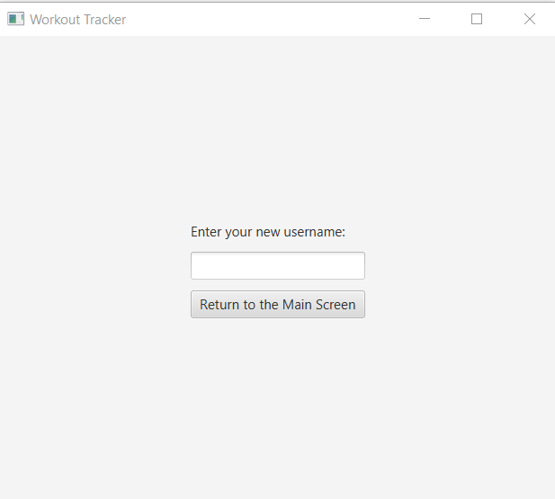

If the username already exists in the database, they will be prompted to enter a different username:

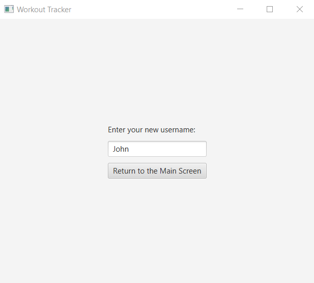

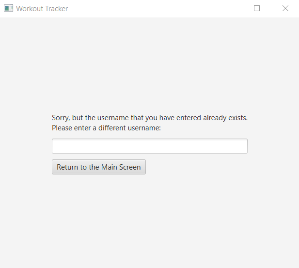

If the new username is valid, their new user will be created:

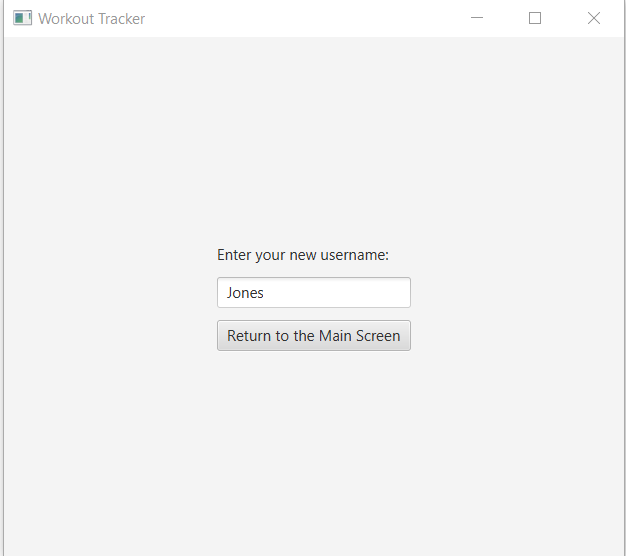

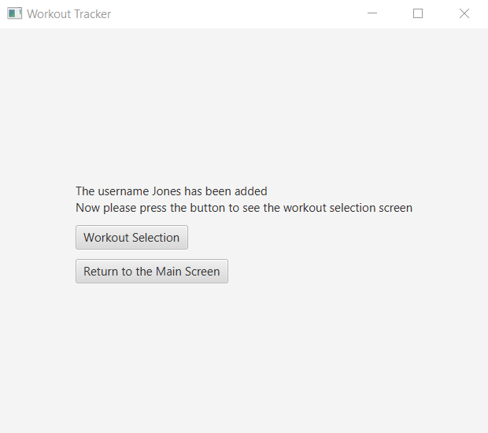

#### Log In
If they chose to log in, they will be prompted to select their username:

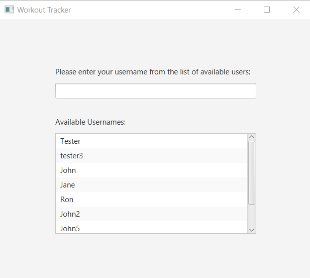

If they enter an invalid username, they will be prompted to select a different one that exists:

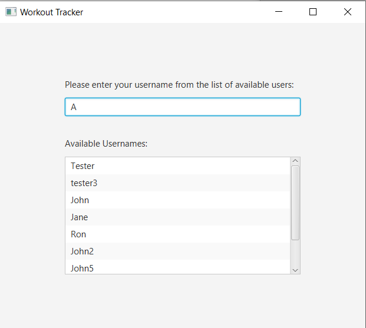

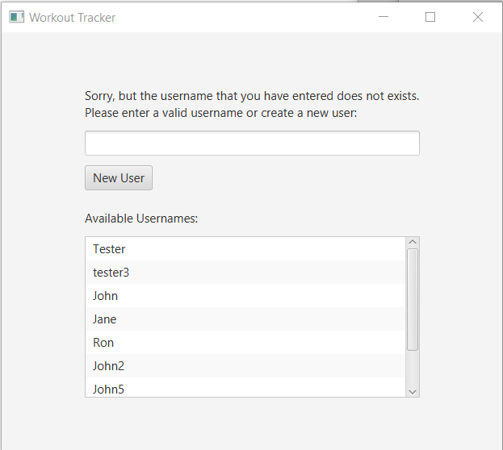

If they select a username that exists, they will be logged into the application:

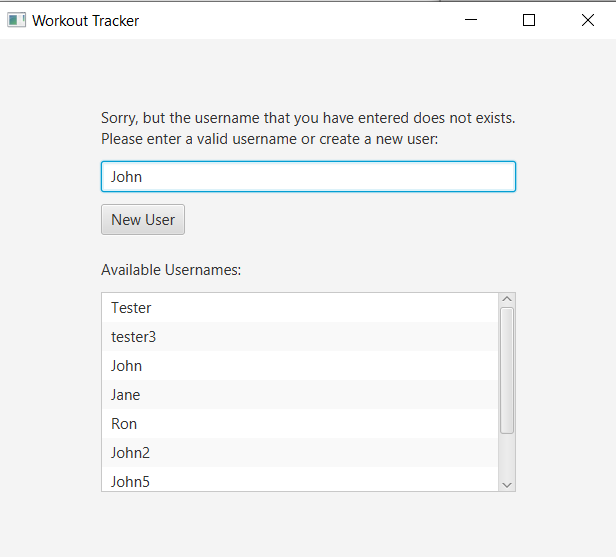

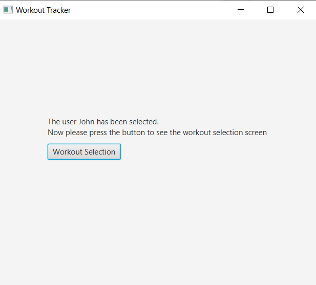

#### Logged In
Once the user is logged into the application, they are prompted to either create a new workout, chose an already existing one, see previous workouts they have completed, or log out:

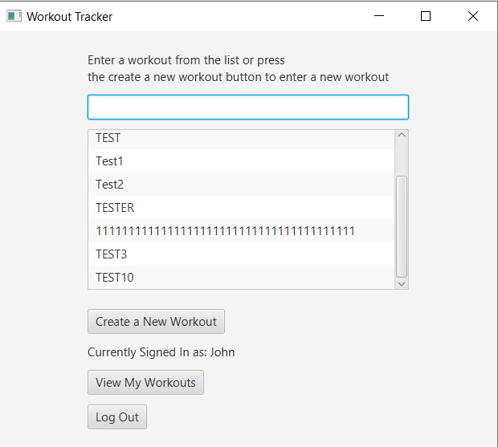

#### Log Out
If they select the log out option, they will be logged out of their account and return to the starting screen:

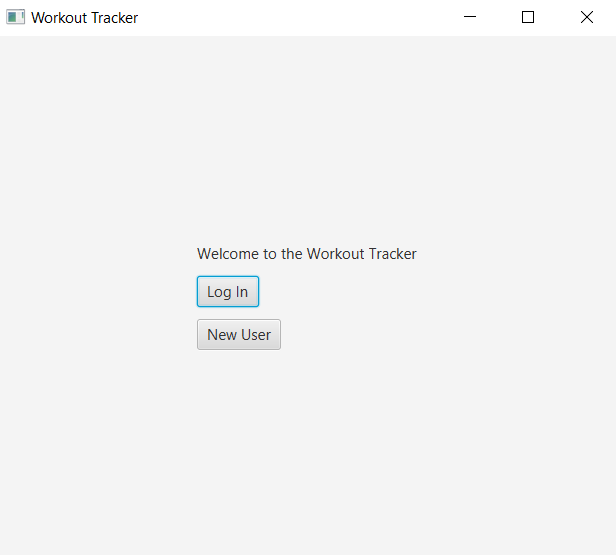

#### View My Workouts
If they select the view my workouts option, they will see a list of previous exercises they have completed along with the number of repetitions accomplished for each exercise and the date that the exercise was created:

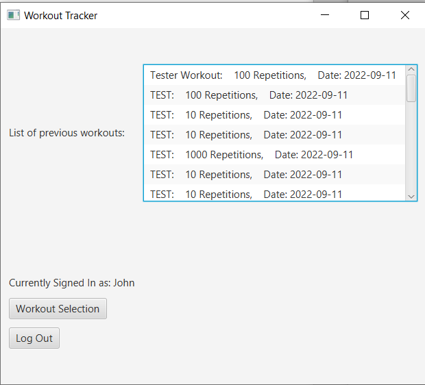

#### Create New Workout
If they chose the create a new workout option, they will be prompted to enter a workout name and the maximum number of repetitions required for that workout:

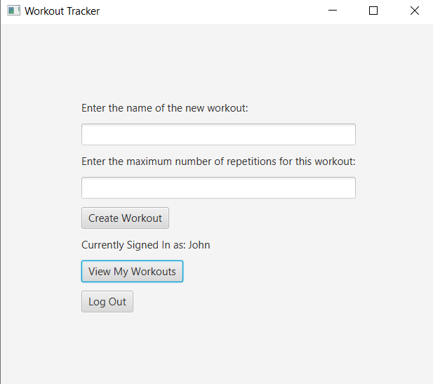

Once they enter a valid new workout, that workout will be saved to the database and they can chose to start it:

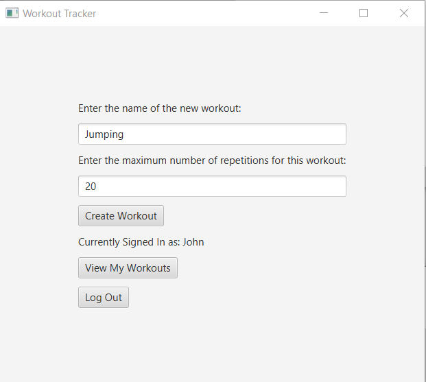

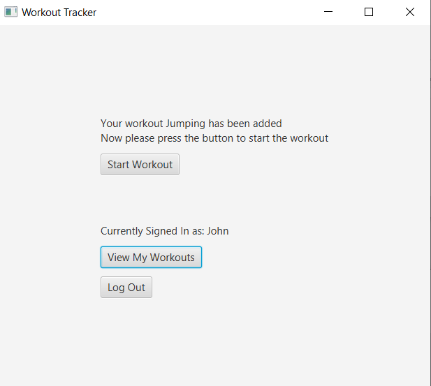

#### Start Existing Workout
If they chose to practice an already added workout, they only have to select one from the list:

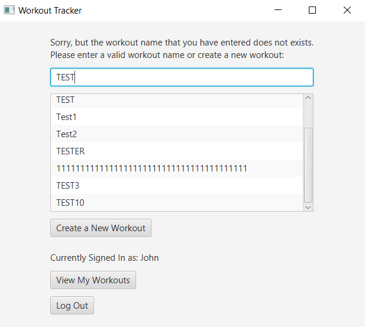

Then chose the number of repetitions that they want to do for the workout:

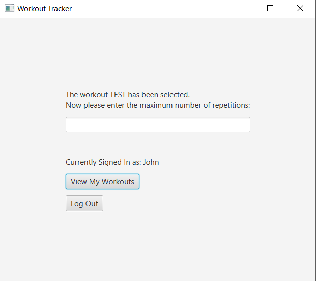

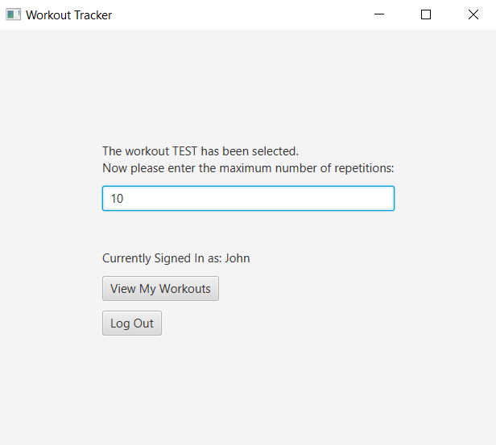

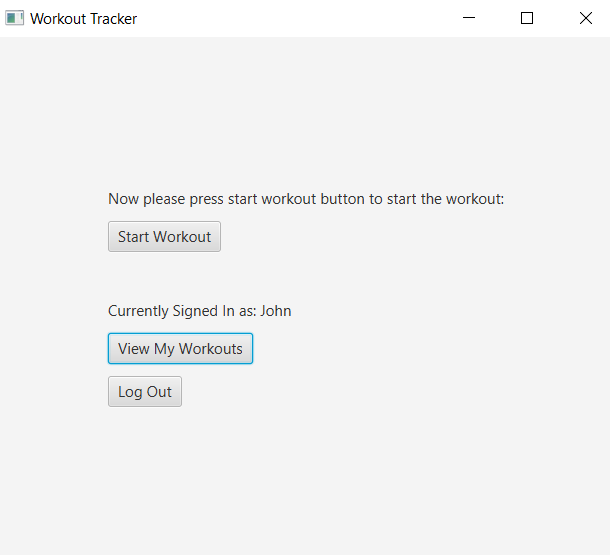

#### Workout
Once the user has selected a workout they want to perform, they will arrive to the workout page. In this page, the user can see the name of the workout they are currently working on, the number of repetitions they have accomplished, and the number of remaining repetitions. They also have the option to increment or decrement by one the repetition counter for the current exercise. Once they are done, they can log out or select the view my workouts option to view their progress and chose if they want to do a different workout.

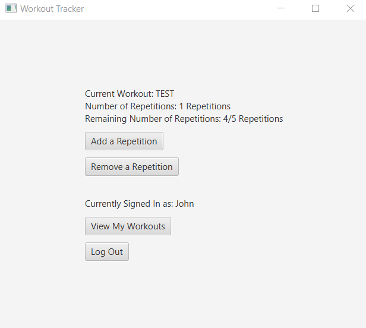

## Back-end
### Workout Database Entity Relationship Diagram
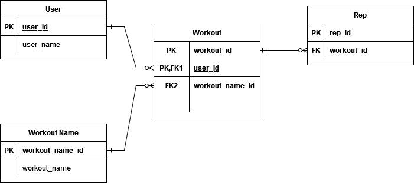

### Workout Database SQL Stored Procedures
#### Create
-addRep:

Using an inputted workout ID, increment by one the repetition counter of the currently selected workout.

-addWorker:

Using an inputted string representing the name of the person that will create an account to workout, create a user (by generating a new user ID) to store their name in the database.

-addWorkoutName:

Using an inputted string representing the name of a new workout, create an entry (by generating a new workout name ID) to store the workout name in the database.

-addWorkout:

Using an inputted user ID, workout name ID, and an integer representing the maximum number of repetitions for a workout, create a new workout and store it in the database.

#### Read

-showAllUsers():

Create a table showing all users stored in the database.

-showWorkouts():

Create a table showing all workouts stored in the database along with the username of the person who completed the specified workout, the current number of repetitions completed in the workout, the number of repetitions remaining, and the date that the workout entry was created.

-showUserWorkouts:

Using an inputted user ID, show all workouts that the specified user has previously completed.

-showWorkoutReps:

Using an inputted workout ID, show the number of repetitions completed in the specified workout.

-showWorkoutNames:

Create a table showing all available workout names stored in the database.

-showUserID:

Using an inputted unique username, retrieve the user ID of that person.

-showNumUser:

Retrieve the total number of users currently stored in the database.

-showWorkoutID:

Using an inputted unique workout name, retrieve the workout ID of the specified workout.

#### Update

#### Delete

-delRep:

Using an inputted workout ID, decrement by one the repetition counter of the currently selected workout.
